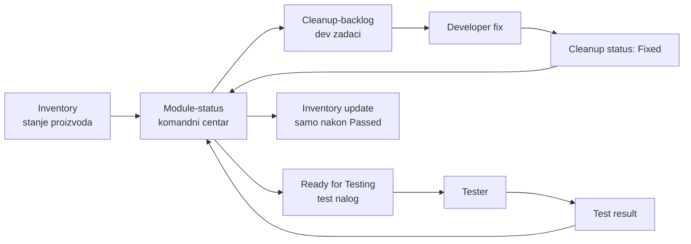
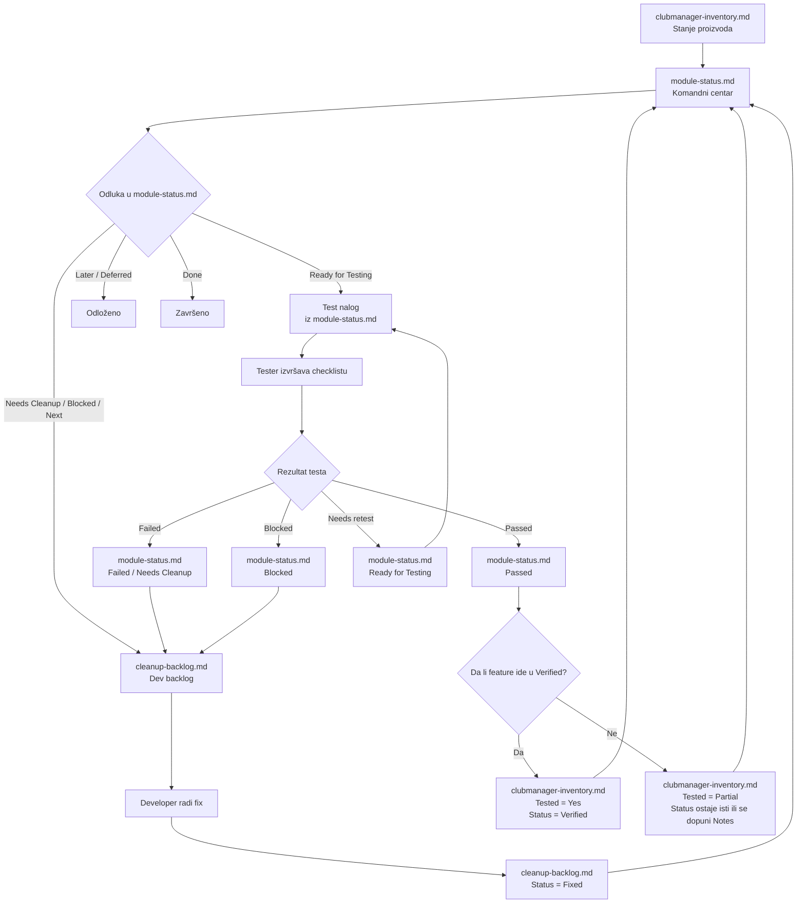

# ClubManager — Inventory, Module Status, Cleanup and Testing Flow

Ovaj dokument definiše obaveznu proceduru kretanja informacija između glavnih dokumentacionih fajlova u ClubManager projektu.

Cilj procedure je da se spriječi rasipanje informacija između chata, audit izvještaja, testera, developera i dokumentacije.

---

## 1. Osnovni princip

ClubManager dokumentacija koristi strogo kontrolisan tok informacija.

```text
Inventory → Module Status → Cleanup Backlog → Developer Fix → Module Status → Testing → Module Status → Inventory
```

Najvažnije pravilo:

```text
module-status.md je komandni centar procesa.
```

Nijedan drugi fajl ne izdaje nalog testeru.

---

## 2. Glavni fajlovi i njihove uloge

### 2.1 `clubmanager-inventory.md`

Putanja:

```text
docs/product/clubmanager-inventory.md
```

Uloga:

```text
Proizvodna mapa aplikacije.
```

Ovaj fajl odgovara na pitanje:

```text
Šta aplikacija ima i u kojem je stanju?
```

Sadrži:

```text
Area
Domain
Module
Feature
BE
FE
DB
Tested
Status
Notes
```

Inventory nije radni backlog i ne izdaje naloge ni developeru ni testeru.

---

### 2.2 `module-status.md`

Putanja:

```text
docs/product/module-status.md
```

Uloga:

```text
Operativni komandni centar.
```

Ovaj fajl odgovara na pitanja:

```text
Šta se radi?
Šta čeka cleanup?
Šta je blokirano?
Šta je spremno za testiranje?
Šta je prošlo test?
Šta se vraća nazad u cleanup?
Šta može ažurirati inventory?
```

`module-status.md` je jedini fajl koji izdaje nalog za testiranje.

---

### 2.3 `cleanup-backlog.md`

Putanja:

```text
docs/product/cleanup-backlog.md
```

Uloga:

```text
Dev radni backlog.
```

Ovaj fajl odgovara na pitanje:

```text
Šta developer popravlja?
```

Cleanup backlog ne izdaje nalog testeru.

Developer u ovom fajlu samo evidentira tok rada:

```text
Open → In Progress → Fixed
```

Kada je stavka označena kao `Fixed`, informacija se vraća u `module-status.md`.

---

### 2.4 Test checkliste

Putanja:

```text
docs/testing/checklists/
```

Uloga:

```text
Dokaz izvršenog testiranja.
```

Tester radi samo testne pakete koje je `module-status.md` označio kao spremne za testiranje.

---

## 3. Ključna pravila procesa

### Pravilo 1 — Inventory pokazuje stanje proizvoda

`clubmanager-inventory.md` prikazuje stanje feature-a:

```text
Planned
Backend only
Frontend only
Implemented
Verified
Polished
Needs cleanup
Deprecated
```

Inventory ne šalje direktno ništa u testiranje i ne daje zadatke developeru.

---

### Pravilo 2 — Module Status je komandni centar

`module-status.md` odlučuje šta se dalje dešava.

Moguće odluke:

```text
Needs Cleanup
Blocked
Next
Ready for Testing
Later / Deferred
Done
Passed
Failed
```

Ako nešto nije prošlo kroz `module-status.md`, ne ide u cleanup i ne ide testeru.

---

### Pravilo 3 — Cleanup Backlog ne komunicira direktno s testerom

Developer ne daje nalog testeru.

`cleanup-backlog.md` služi samo za dev rad:

```text
Open
In Progress
Fixed
Retested
Deferred
Won’t fix
```

Kada developer završi fix, status ide na:

```text
Fixed
```

Nakon toga `module-status.md` odlučuje da li stavka ide na testiranje.

---

### Pravilo 4 — Tester dobija nalog samo iz Module Statusa

Tester ne dobija nalog iz:

```text
cleanup-backlog.md
clubmanager-inventory.md
chat dogovora
Codex audit izvještaja
```

Tester dobija nalog iz:

```text
module-status.md → Ready for Testing
```

Nalog mora sadržavati:

```text
Test package
Scope
Checklist
Known exclusions
Status
Notes
```

---

### Pravilo 5 — Tester rezultat se vraća u Module Status

Tester rezultat se ne upisuje prvo u inventory.

Tester rezultat ide u:

```text
module-status.md
```

Mogući rezultati:

```text
Passed
Failed
Blocked
Needs retest
```

Nakon toga `module-status.md` odlučuje:

```text
Passed → mogući inventory update
Failed → nazad u cleanup-backlog
Blocked → nazad u cleanup-backlog ili product decision
Needs retest → novi test nalog
```

---

### Pravilo 6 — Inventory se ažurira tek na kraju

`clubmanager-inventory.md` se ažurira tek kada postoji dokaz da je feature stvarno potvrđen.

Primjeri:

```text
Tested = Yes
Status = Verified
```

ili:

```text
Tested = Partial
Status ostaje Implemented / Needs cleanup
```

Važno:

```text
Fixed nije isto što i Verified.
```

Značenja:

| Termin   | Značenje                                                        |
| -------- | --------------------------------------------------------------- |
| Fixed    | Developer je završio popravku                                   |
| Retested | Tester je ponovio test nakon fix-a                              |
| Verified | Feature je funkcionalno potvrđen i inventory status je ažuriran |
| Polished | Feature je potvrđen i dodatno UX/visualno dotjeran              |

---

## 4. Kratki operativni dijagram

Ovaj dijagram prikazuje osnovni tok procesa.



---

## 5. Detaljni dijagram toka

Ovaj dijagram prikazuje sve glavne grane procesa.



---

## 6. Tok za novi bug koji otkrije tester

Kada tester otkrije novi bug, proces je sljedeći:

```text
Tester report
→ module-status.md
→ cleanup-backlog.md
→ developer fix
→ cleanup-backlog.md = Fixed
→ module-status.md = Ready for Testing
→ tester retest
→ module-status.md = Passed / Failed / Blocked
→ inventory update samo ako je feature potvrđen
```

### 6.1 Tester report

Tester mora dostaviti:

```text
Test ID:
Status:
Environment:
User / role:
URL:
Steps:
Expected result:
Actual result:
Screenshot:
Notes:
```

---

### 6.2 Upis u Module Status

Bug se prvo upisuje u:

```text
module-status.md
```

Moguće sekcije:

```text
Needs Cleanup
Blocked
Testing Results
```

Ako je bug već poznat, ne pravi se duplikat. Samo se doda dokaz:

```text
Confirmed by test TMVP-xxx on DEV.
```

---

### 6.3 Ulaz u Cleanup Backlog

Tek nakon što je bug u `module-status.md`, može ući u:

```text
cleanup-backlog.md
```

Tu dobija cleanup ID:

```text
CLN-P0-xxx
CLN-P1-xxx
CLN-P2-xxx
```

---

### 6.4 Fix

Developer radi po cleanup ID-u.

Status u `cleanup-backlog.md`:

```text
Open → In Progress → Fixed
```

Developer ne izdaje nalog testeru.

---

### 6.5 Ready for Testing

Kada je fix označen kao `Fixed`, informacija se vraća u:

```text
module-status.md
```

`module-status.md` odlučuje da li ide u:

```text
Ready for Testing
```

Ako ide, tester dobija nalog iz `module-status.md`.

---

### 6.6 Retest

Tester izvršava checklistu ili targeted retest.

Rezultat ide nazad u:

```text
module-status.md
```

Ako je rezultat `Passed`, cleanup stavka može biti označena kao:

```text
Retested
```

Ako je rezultat `Failed` ili `Blocked`, stavka se vraća u cleanup.

---

## 7. Tok za planirano testiranje bez prethodnog buga

Nije svaki test povezan s bugom.

Za planirani test osnovnog korisničkog toka:

```text
Inventory pokazuje da feature postoji
→ module-status.md označi test paket kao Ready for Testing
→ tester izvršava checklistu
→ rezultat se vraća u module-status.md
→ ako je Passed, inventory može preći u Verified
```

Primjer:

```text
Tenant MVP Basic Flow
```

Ovaj test paket nije nužno nastao iz jednog cleanup item-a. Nastaje iz release plana i module-status odluke.

---

## 8. Statusi po fajlovima

### 8.1 Inventory statusi

Koriste se u:

```text
clubmanager-inventory.md
```

| Status        | Značenje                                        |
| ------------- | ----------------------------------------------- |
| Planned       | Planirano, nije implementirano                  |
| Backend only  | Backend postoji, FE ne postoji                  |
| Frontend only | FE postoji, backend nije potvrđen               |
| Implemented   | Feature postoji, ali nije funkcionalno potvrđen |
| Verified      | Feature je ručno funkcionalno potvrđen          |
| Polished      | Feature je potvrđen i UX/visualno dotjeran      |
| Needs cleanup | Feature postoji, ali ima poznate probleme       |
| Deprecated    | Više se ne koristi                              |

---

### 8.2 Module Status statusi

Koriste se u:

```text
module-status.md
```

| Status             | Značenje                                   |
| ------------------ | ------------------------------------------ |
| Done               | Operativno završeno                        |
| In Progress        | Aktivno se radi                            |
| Next               | Sljedeće za rad                            |
| Needs Verification | Treba provjeriti                           |
| Needs Cleanup      | Treba cleanup/fix                          |
| Blocked            | Blokirano                                  |
| Ready for Testing  | Module-status je izdao nalog za testiranje |
| Testing            | Testiranje u toku                          |
| Passed             | Test prošao                                |
| Failed             | Test pao                                   |
| Later              | Kasnije                                    |
| Deprecated         | Više se ne koristi                         |

---

### 8.3 Cleanup Backlog statusi

Koriste se u:

```text
cleanup-backlog.md
```

| Status      | Značenje                    |
| ----------- | --------------------------- |
| Open        | Stavka otvorena             |
| In Progress | Developer radi              |
| Fixed       | Developer završio fix       |
| Retested    | Tester potvrdio fix         |
| Deferred    | Odloženo                    |
| Won’t fix   | Svjesno se neće popravljati |

---

### 8.4 Checklist statusi

Koriste se u:

```text
docs/testing/checklists/
```

| Status       | Značenje       |
| ------------ | -------------- |
| Not tested   | Nije testirano |
| Passed       | Prošlo         |
| Failed       | Palo           |
| Blocked      | Blokirano      |
| Needs retest | Treba ponoviti |
| Deferred     | Odloženo       |

---

## 9. Primjer kompletnog toka

### Problem

Tester ne može uploadovati dokument tipa `LicenseDocument`.

---

### Korak 1 — Tester report

```text
Test ID: TMVP-302
Status: Failed
Module: Documents
Actual: Upload fails for LicenseDocument
```

---

### Korak 2 — Module Status

U `module-status.md`:

```text
Documents Engine | Document type mismatch | Tester confirmed LicenseDocument upload failure | Align FE/backend/schema types
```

---

### Korak 3 — Cleanup Backlog

U `cleanup-backlog.md`:

```text
CLN-P0-004 | Documents Engine | Document type mismatch | Open
```

---

### Korak 4 — Developer fix

U `cleanup-backlog.md`:

```text
CLN-P0-004 | Status = In Progress
CLN-P0-004 | Status = Fixed
```

---

### Korak 5 — Module Status izdaje test nalog

U `module-status.md`:

```text
Documents type mismatch fixed.
Ready for Testing.
Retest: TMVP-302.
```

---

### Korak 6 — Tester retest

U checklisti:

```text
TMVP-302 = Passed
```

---

### Korak 7 — Module Status prima rezultat

U `module-status.md`:

```text
TMVP-302 passed.
CLN-P0-004 retested.
```

---

### Korak 8 — Inventory update

Ako je cijeli document upload/type flow potvrđen:

```text
Document type handling
Tested = Yes
Status = Verified
```

Ako je potvrđen samo jedan uski slučaj:

```text
Tested = Partial
Status ostaje Implemented ili Needs cleanup
Notes se dopunjavaju.
```

---

## 10. Zabranjeni tokovi

Ovi tokovi nisu dozvoljeni:

```text
Chat → cleanup-backlog.md
Chat → tester nalog
Developer → tester direktno
cleanup-backlog.md → tester direktno
Tester → clubmanager-inventory.md direktno
Inventory → cleanup-backlog.md direktno
Inventory → tester direktno
Codex audit → cleanup-backlog.md direktno
```

Sve mora proći kroz:

```text
module-status.md
```

---

## 11. Dozvoljeni tokovi

Dozvoljeni tokovi su:

```text
Inventory → Module Status
Module Status → Cleanup Backlog
Cleanup Backlog → Module Status
Module Status → Tester
Tester → Module Status
Module Status → Inventory
Module Status → Later / Deferred
```

---

## 12. Jedna rečenica procesa

```text
Inventory pokazuje stanje proizvoda, module-status komanduje radom i testiranjem, cleanup-backlog vodi dev popravke, tester vraća rezultat u module-status, a inventory se ažurira tek nakon dokaza.
```

---

## 13. Release 1 napomena

Trenutni fokus projekta:

```text
Release 1 — Tenant Production MVP
```

Primarni korisnici:

```text
sekretar kluba
vlasnik / menadžer kluba
```

Release 1 prioritet:

```text
Stabilna Tenant App aplikacija za svakodnevno vođenje kluba.
```

Odloženo za kasnije:

```text
Player Portal rollout
Admin Platform polish
Platform Billing
Notifications
Advanced reports
Standalone payments
```

To znači da `module-status.md` može svjesno označiti određene stavke kao:

```text
Later
Deferred
```

čak i kada su tehnički važne, ako ne blokiraju Release 1 Tenant MVP.
